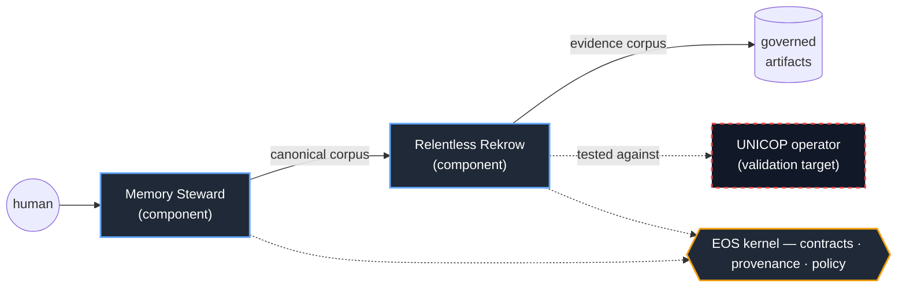

# EOS

## Engineering Operating System by Homeldev

EOS is an **AI-native engineering lifecycle ecosystem**: a small interoperability and governance kernel, plus independently useful engineering components that interoperate through that kernel’s contracts, provenance, policy, and trust boundaries.

EOS is **not** a chatbot, a code-completion product, an autonomous agent framework, or a monolithic runtime. Its defining commitment: **the asset EOS produces is not code alone — it is the governed decision trail behind the code.**

EOS is currently in early-stage, pre-canonical architecture and implementation.

-----

## What EOS Is (in one line)

The contract layer that lets engineering components share governed data without becoming a monolith.

- **Kernel** — owns the rules of interoperability (identity, contracts, provenance, policy, trust). Enforces contracts; never makes engineering decisions.
- **Components** — independently useful systems that run standalone or inside EOS.
- **Targets** — external projects EOS is validated against. Never part of EOS.

See **[Document 03](docs/03_kernel_and_components.md)** for the authoritative definitions.

-----

## Current Components

- **Memory Steward** *(working concept)* — deterministic cognitive control plane; produces and preserves structured engineering intent as a canonical corpus.
- **Relentless Rekrow** *(almost-working skeleton)* — governed AI execution on the **Planner → Slicer → Worker** model: Planner decomposes, deterministic Slicer enriches slices, Worker orchestrates the inner loop of Coder → Verifier (deterministic) → Controller (pass/fail/retry), with a Reviewer (LLM adviser) guiding the next Coder attempt on retries. Consumes canonical docs, emits an evidence corpus.

## Validation Target (not a component)

- **UNICOP — Unified Infrastructure Control Plane.** A separate product. Its **Control Plane Operator** (a Golang Kubernetes-style operator) is the concrete, hard project Relentless Rekrow is pressure-tested against. RR emerged from the difficulty of building that operator with AI assistance.

**The north star:** *Can Relentless Rekrow build the UNICOP Control Plane Operator under governance?*

-----

## Documentation

|Doc                                                 |Title                                         |Status      |
|----------------------------------------------------|----------------------------------------------|------------|
|[00](docs/00_style_guide.md)                        |Style Guide                                   |FOUNDATIONAL|
|[01](docs/01_manifest.md)                           |Manifest (philosophy)                         |FOUNDATIONAL|
|[02](docs/02_ecosystem_analysis.md)                 |Ecosystem Analysis                            |CANONICAL   |
|[03](docs/03_kernel_and_components.md)              |Kernel and Component Model — **the anchor**   |DRAFT       |
|[04](docs/04_execution_architecture.md)             |Execution Architecture                        |DRAFT       |
|[05](docs/05_engineering_trajectory_intelligence.md)|Engineering Trajectory Intelligence           |DRAFT       |
|[06](docs/06_horizon.md)                            |Horizon (lifecycle, training, federation, hub)|EXPLORATORY |
|[07](docs/07_roadmap.md)                            |Roadmap                                       |DRAFT       |

**Reading order:** Start with the Manifest (01) for the *why*, then the Kernel and Component Model (03) for the *what*. Document 06 is deliberately speculative — read it as a destination, not a plan.

-----

## Status Vocabulary

Every document carries a status so maturity is never implied: `FOUNDATIONAL`, `CANONICAL`, `DRAFT`, `WORKING`, `EXPLORATORY`, `DEPRECATED`. Speculation is welcome anywhere, provided it is stamped honestly. See [Document 00 §2](docs/00_style_guide.md).

-----

## Minimum Viable EOS

The smallest thing that proves the thesis is three items, not a platform:

1. Memory Steward emits a canonical corpus (with provenance).
1. Relentless Rekrow consumes it and emits an evidence corpus.
1. One artifact registry convention ties them together.

That demonstrates the core loop: `docs → build → evidence`. Everything else is downstream of that handshake working once.
