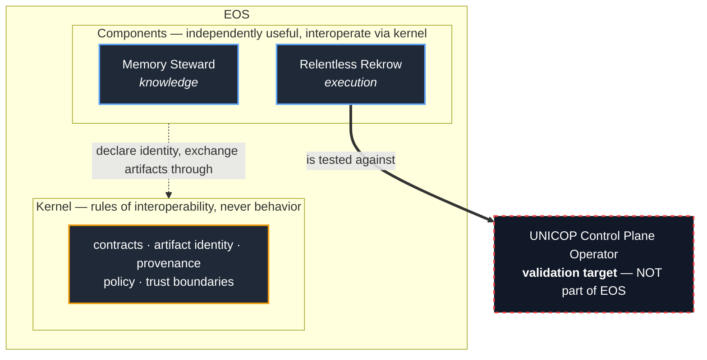

# EOS KERNEL AND COMPONENT MODEL

## What EOS Is — Kernel, Components, Targets, and Boundaries

### Foundational Engineering Specification (Document 03)

*Namespace: EOS • Owner: architecture-team • Status: DRAFT*

-----

## Navigation

**← [Prev: Document 02 (Ecosystem Analysis)](02_ecosystem_analysis.md) | [Next: Document 04 (Execution Architecture)](04_execution_architecture.md) →**

- [0. Status, Scope, and Authority](#0-status-scope-and-authority)
- [1. Purpose](#1-purpose)
- [2. The Single Definition of EOS](#2-the-single-definition-of-eos)
- [3. Kernel vs Components vs Targets](#3-kernel-vs-components-vs-targets)
- [4. The EOS Kernel](#4-the-eos-kernel)
- [5. What the Kernel Refuses to Do](#5-what-the-kernel-refuses-to-do)
- [6. The Component Model](#6-the-component-model)
- [7. Component Classes](#7-component-classes)
- [8. Standalone vs EOS-Integrated Mode](#8-standalone-vs-eos-integrated-mode)
- [9. Product / Infrastructure / Service Distinction](#9-product--infrastructure--service-distinction)
- [10. Current Components](#10-current-components)
- [11. External Validation Targets (Not Components)](#11-external-validation-targets-not-components)
- [12. Data Products](#12-data-products)
- [13. Critical Invariants](#13-critical-invariants)
- [14. Minimum Viable EOS](#14-minimum-viable-eos)
- [15. Closing Statement](#15-closing-statement)

-----

## 0. Status, Scope, and Authority

**Status:** DRAFT
**Audience:** EOS architect, component developers, documentation maintainers
**Change policy:**

- Editable while DRAFT
- This document is the **single authority** on what EOS is, what a component is, and what is merely a target
- All other documents defer to this one on those questions

This is the anchor document. Where any other document disagrees with this one about the kernel/component/target distinction, this document wins and the other MUST be reconciled.

[Back to top](#navigation)

-----

## 1. Purpose

EOS documentation historically gave inconsistent answers to one question: *what actually is EOS?* The manifest implied one thing, the architecture document drew a six-box stack, and later synthesis proposed a kernel-and-component ecosystem. A reader could not get a straight answer.

This document settles it. It defines EOS as a small kernel plus a set of independently useful components, and it draws the hard line between what is *part of EOS*, what is a *component that uses EOS*, and what is an *external target EOS is tested against*.

[Back to top](#navigation)

-----

## 2. The Single Definition of EOS

> **EOS is an AI-native engineering lifecycle ecosystem: a small interoperability and governance kernel, plus a set of independently useful engineering components that interoperate through that kernel’s contracts, provenance, policy, and trust boundaries.**

EOS is **not** a monolithic application. It is **not** a single runtime. It is **not** any one of its components.

The shortest possible statement: **EOS is the contract layer that lets engineering components share governed data without becoming a monolith.**

[Back to top](#navigation)

-----

## 3. Kernel vs Components vs Targets

Three categories, and everything in or around EOS is exactly one of them:

|Category     |Definition                                                                                    |Examples                                                                               |
|-------------|----------------------------------------------------------------------------------------------|---------------------------------------------------------------------------------------|
|**Kernel**   |The small shared substrate that defines how components interoperate. Owns rules, not behavior.|contract registry, artifact identity, provenance model, policy engine, trust boundaries|
|**Component**|An independently useful system that operates standalone or inside EOS via kernel contracts.   |Memory Steward, Relentless Rekrow                                                      |
|**Target**   |An external project EOS is used on or validated against. Not part of EOS.                     |UNICOP and its Control Plane Operator                                                  |


> **Hard Invariant:** A target is never a component. A component is never the kernel. Conflating these is the specific failure that produced the earlier documentation confusion.



*The dashed red box sits outside EOS on purpose — UNICOP is what EOS is proven against, never part of it. The kernel holds the rules; components do the work.*

[Back to top](#navigation)

-----

## 4. The EOS Kernel

The kernel is small by design. It is not necessarily a single binary or service — it is the shared contract and governance substrate. It owns the *rules of interoperability*, and nothing else.

The kernel owns:

- **Component identity** — what a component is, what it declares it can do
- **Artifact identity** — stable identity for every meaningful artifact
- **Contract registry** — how components exchange data
- **Provenance model** — who produced what, from what inputs, under what policy
- **Event and telemetry schema** — the shape of what components emit
- **Lifecycle state model** — the states artifacts and runs move through
- **Policy model** — what is allowed: read, export, train, influence, mutate
- **Trust and federation boundary model** — what may cross which boundary

The kernel answers questions, it does not perform work:

```text
What is this artifact?
Where did it come from?
Which component produced it, under what policy?
Can another component consume it?
Can it leave this trust boundary?
Can it be used for training?
Can it influence planning?
```

[Back to top](#navigation)

-----

## 5. What the Kernel Refuses to Do

The kernel is defined as much by its refusals as its responsibilities. This is what protects EOS from collapsing into a monolith.

> **Hard Invariant:** The kernel enforces contracts. It NEVER makes engineering decisions.

The kernel MUST NOT:

- **Decide.** It does not plan, decompose, code, verify, or review. Those are component behaviors.
- **Execute.** It runs no engineering work. It holds no slice loop.
- **Reason probabilistically.** No model lives in the kernel. The kernel is deterministic.
- **Own component internals.** Components interoperate through contracts, never shared internals. A component MUST be replaceable without changing the kernel.
- **Mutate on behalf of a component.** It authorizes; it does not act.
- **Absorb.** The kernel never grows to swallow a component’s responsibility because that is “convenient.”

When in doubt about whether something belongs in the kernel, the answer is almost always no. A capability belongs in the kernel only if it is a *rule of interoperability* that every component must share. Everything else is a component.

[Back to top](#navigation)

-----

## 6. The Component Model

A component is an independently useful engineering system. The defining test of a real component:

> **A component MUST be able to deliver value standalone, outside EOS.** If it only makes sense inside EOS, it is not a component — it is part of the kernel or a feature of another component.

Each mature component eventually declares:

```text
component_id
component_class
standalone_supported: true | false
eos_integrated_supported: true | false
input_contracts: [...]
output_contracts: [...]
artifact_types: [...]
trust_boundary
telemetry_emitted: [...]
human_approval_boundaries: [...]
failure_modes: [...]
```

This declaration is itself a kernel contract (component registry). It is illustrative here, not final schema.

[Back to top](#navigation)

-----

## 7. Component Classes

Six classes currently appear necessary. Not all are built; their presence here is architectural placement, not an implementation claim. Classes beyond Knowledge and Execution are **DRAFT** placement of **EXPLORATORY** components — see Document 06.

### 7.1 Knowledge Components

Capture, formalize, preserve, retrieve, and stabilize engineering memory. Produce canonical corpora.
Primary: **Memory Steward**.

### 7.2 Execution Components

Governed implementation, bounded execution, verification-driven progression, evidence production.
Primary: **Relentless Rekrow**.

### 7.3 Learning / Training Components *(EXPLORATORY)*

Dataset building, corpus admission, fine-tuning, evaluation, model lineage, release governance.

### 7.4 Operational / Lifecycle Components *(EXPLORATORY)*

Turn runtime evidence into governed engineering objectives. Support/SRE models, Lifecycle Architect, RCA analysis, maintenance objective generation.

### 7.5 Integration Components

Bridge external tools into kernel contracts: GitLab, MCP, Open WebUI, CI/CD, telemetry adapters. Plumbing — governed, bounded, observable.

### 7.6 Federation / Hub Components *(EXPLORATORY)*

Share, isolate, and govern data and models across instances and trust boundaries.

[Back to top](#navigation)

-----

## 8. Standalone vs EOS-Integrated Mode

Every serious component supports both modes. This distinction is what prevents monolithic collapse.

|Component              |Standalone                            |EOS-Integrated                                                    |
|-----------------------|--------------------------------------|------------------------------------------------------------------|
|Memory Steward         |brainstorm → engineering memory / docs|produces planner-ready canonical corpus, emits knowledge artifacts|
|Relentless Rekrow      |canonical docs → software + evidence  |consumes canonical corpus, emits trajectory data into EOS         |
|Trainer *(EXPLORATORY)*|dataset + compute → fine-tuned model  |consumes governed EOS corpora, emits models with lineage          |

[Back to top](#navigation)

-----

## 9. Product / Infrastructure / Service Distinction

- **Products** — user-facing, standalone value: Memory Steward, Relentless Rekrow.
- **Infrastructure** — enables EOS, not primary user-facing: contract registry, artifact registry, policy engine, model registry.
- **Services** — operated centrally or privately: community hub, hosted training, enterprise support.

This distinction matters for the open / community / enterprise strategy (Document 06, EXPLORATORY).

[Back to top](#navigation)

-----

## 10. Current Components

Only two components are real today.

### 10.1 Memory Steward

**Status: working concept.** A deterministic memory/cognitive control plane. Not a chatbot. Separates model reasoning from memory and policy via a dual-plane design (read-only user/data plane; write-exclusive control/steward plane). Memory admission is asynchronous; memory is stored as atomic facts carrying scope and confidence, not conversation dumps. Aims to prevent probabilistic drift and memory corruption.

**Invariant:** Memory Steward does not build software. It produces and preserves structured engineering intent.

### 10.2 Relentless Rekrow

**Status: almost-working skeleton.** A governed AI-assisted execution system built on the canonical **Planner → Slicer → Worker** model: the Planner decomposes, the deterministic Slicer enriches each slice into a bounded contract, and the Worker orchestrates an inner loop of Coder → Verifier (deterministic) → Controller (decides pass/fail/retry), with a Reviewer (LLM adviser) guiding the next Coder attempt on retries. Consumes canonical documentation, executes bounded slices through this iterative convergence loop, emits an execution evidence corpus and trajectory data.

**Invariant:** Relentless Rekrow does not own the EOS lifecycle. It executes bounded engineering work under contracts and governance.

The canonical Memory-Steward → RR handshake — canonical corpus in, evidence corpus out — is the **proof of life for EOS**. If those two components exchange one real artifact with provenance intact, the kernel thesis holds.

[Back to top](#navigation)

-----

## 11. External Validation Targets (Not Components)

> **Hard Invariant:** A validation target is an external project EOS is tested against. It is NEVER an EOS component and MUST NOT appear in EOS architecture as a subsystem.

### 11.1 UNICOP — Unified Infrastructure Control Plane

UNICOP is a **separate product**: a large infrastructure control plane with many moving parts. Those parts are managed and lifecycled by the **UNICOP Control Plane Operator**, a Golang Kubernetes-style operator that is a subproject of UNICOP.

The UNICOP Control Plane Operator is the concrete, hard, real project on which Relentless Rekrow is pressure-tested. The difficulty of building that operator with AI assistance is, historically, *why Relentless Rekrow exists* — RR emerged from that wall.

UNICOP’s role in EOS documentation is therefore exactly one sentence of standing: **it is the primary external validation target against which RR is proven, and nothing more.** It is not a layer, subsystem, or component of EOS.

The clearest success test EOS has: *can Relentless Rekrow build the UNICOP Control Plane Operator under governance?* That is a concrete north star, not an abstract thesis.

[Back to top](#navigation)

-----

## 12. Data Products

EOS is fundamentally a data-producing engineering lifecycle. The important output is not only code. Each corpus is a governed data product with its own retention and admission rules.

|Corpus                        |Produced by                         |Status     |
|------------------------------|------------------------------------|-----------|
|Canonical Documentation Corpus|Memory Steward + human              |real       |
|Execution Evidence Corpus     |Relentless Rekrow                   |real       |
|Trajectory Corpus             |RR controllers, verifiers, reviewers|emerging   |
|Production Telemetry Corpus   |deployed products                   |EXPLORATORY|
|Incident / RCA Corpus         |operators, SRE models, humans       |EXPLORATORY|
|Training / Evaluation Corpus  |dataset builder, trainer            |EXPLORATORY|

Detail on trajectory: Document 05. Detail on the EXPLORATORY corpora: Document 06.

[Back to top](#navigation)

-----

## 13. Critical Invariants

These govern the kernel and all components.

1. **Human authority is authoritative.** EOS amplifies engineering judgment; it does not replace it.
1. **Probabilistic systems are untrusted inputs.** LLM output passes through contracts, schema validation, verification, review, controller decisions, and policy gates before it is authoritative.
1. **Telemetry is evidence, not command.** Telemetry never directly mutates a product. Evidence → diagnosis → objective → governed execution.
1. **Training is governed.** EOS data is not automatically training data. Corpus admission MUST be explicit.
1. **Components remain bounded.** EOS MUST NOT collapse components into one monolith. Component independence is strategic.
1. **Federation is deny-by-default.** No data leaves a trust boundary unless explicitly allowed.
1. **Provenance is mandatory.** Every meaningful artifact MUST be attributable.
1. **Open core is not crippled.** Enterprise value comes from governance, scale, privacy, federation, and support — never from deliberately weakening the open architecture.

[Back to top](#navigation)

-----

## 14. Minimum Viable EOS

The hard question is not whether EOS is conceptually valid. It is: *what is the smallest EOS that proves the thesis?*

The true minimum is three things, not ten:

1. **Memory Steward emits a canonical corpus** (one real document with provenance).
1. **Relentless Rekrow consumes that corpus** and emits an execution evidence corpus.
1. **One artifact registry convention** ties them together with provenance intact.

That is the kernel proving it can make two components interoperate. It demonstrates the core loop:

```text
docs -> build -> evidence
```

Everything else — training, lifecycle, federation, hub — is downstream of that handshake working *even once*. Those are EXPLORATORY (Document 06) until this minimum is real.

> **Warning:** Earlier drafts described a “minimum viable EOS” as a ten-item list that was, in fact, the entire vision with the word “minimal” attached. That is not a minimum. The three items above are.

[Back to top](#navigation)

-----

## 15. Closing Statement

This document matters because it ends the project’s central ambiguity. EOS is a small kernel plus independently useful components, validated against external targets. The kernel enforces contracts and refuses to decide. Components deliver standalone value and interoperate through the kernel. Targets like UNICOP are what EOS is proven against, never part of it.

Hold this line and EOS stays coherent as it grows. Lose it and EOS becomes the platform soup its own analysis warns against.

-----

**END OF DOCUMENT 03**
