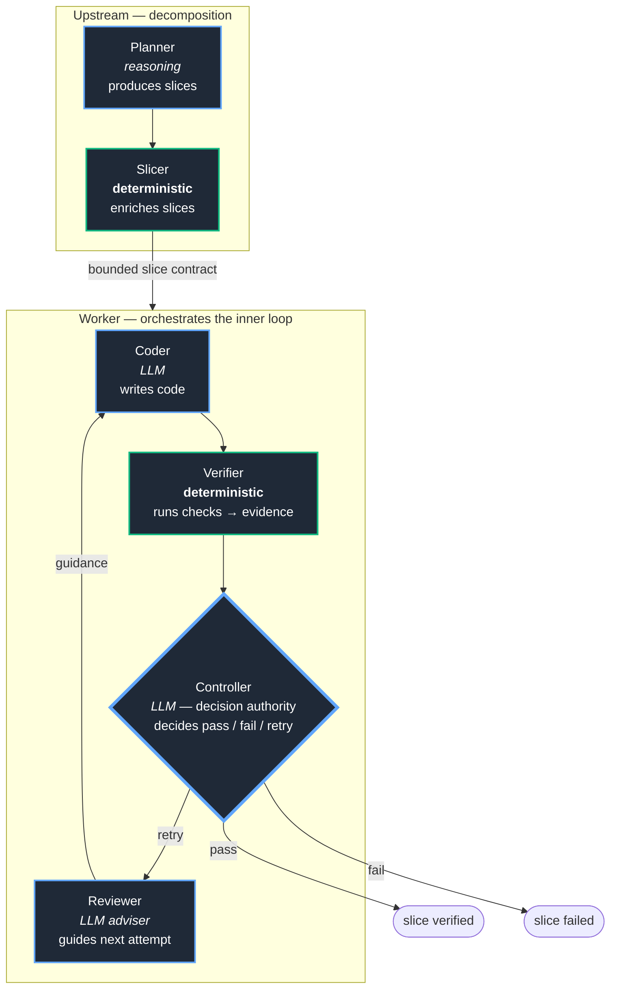

# EOS EXECUTION ARCHITECTURE

## Governed Execution, Slice Model, and Architectural Mechanisms

### Foundational Engineering Specification (Document 04)

*Namespace: EOS • Owner: architecture-team • Status: DRAFT*

-----

## Navigation

**← [Prev: Document 03 (Kernel and Component Model)](03_kernel_and_components.md) | [Next: Document 05 (Engineering Trajectory Intelligence)](05_engineering_trajectory_intelligence.md) →**

- [0. Status, Scope, and Authority](#0-status-scope-and-authority)
- [1. Purpose](#1-purpose)
- [2. Architectural Positioning](#2-architectural-positioning)
- [3. Core Architectural Principles](#3-core-architectural-principles)
- [4. The Knowledge → Execution Handshake](#4-the-knowledge--execution-handshake)
- [5. Memory Steward (Execution View)](#5-memory-steward-execution-view)
- [6. Relentless Rekrow (Execution View)](#6-relentless-rekrow-execution-view)
- [7. Engineering Workflow Model](#7-engineering-workflow-model)
- [8. Planner Objective Model](#8-planner-objective-model)
- [9. Slice Execution Model](#9-slice-execution-model)
- [10. The Iterative Convergence Loop](#10-the-iterative-convergence-loop)
- [11. Verification and Governance Model](#11-verification-and-governance-model)
- [12. Engineering Artifact Model](#12-engineering-artifact-model)
- [13. Architectural Mechanisms](#13-architectural-mechanisms)
- [14. MCP and Tooling Integration](#14-mcp-and-tooling-integration)
- [15. Architectural Constraints](#15-architectural-constraints)
- [16. Closing Statement](#16-closing-statement)

-----

## 0. Status, Scope, and Authority

**Status:** DRAFT
**Audience:** Component developers, RR/MS implementers, architects
**Change policy:**

- Editable while DRAFT
- Defers to Document 03 on kernel/component/target definitions

This document defines *how execution works* inside EOS: the governed workflow, the slice model, the convergence loop, and the architectural mechanisms (lineage, escalation, isolation) that make bounded execution safe. It is the architecture beneath the philosophy of Document 01 and the structure of Document 03.

Implementation-level detail for Relentless Rekrow Phase 1 lives in the RR Phase 1 Implementation Plan, which is the authority for what is being built now. This document is the authority for the architectural shape.

[Back to top](#navigation)

-----

## 1. Purpose

EOS execution transforms a canonical engineering corpus into verified software plus a governed evidence corpus. This document specifies the architecture of that transformation: the roles, the contracts between them, the loop they execute, and the invariants that keep probabilistic generation bounded.

[Back to top](#navigation)

-----

## 2. Architectural Positioning

EOS execution sits between knowledge and learning:

```text
canonical corpus (knowledge)
  -> governed execution (this document)
  -> evidence + trajectory corpus
  -> trajectory intelligence (Document 05)
```

Execution is performed by **components** (primarily Relentless Rekrow) operating under **kernel** contracts (Document 03). The kernel governs; the component executes.

[Back to top](#navigation)

-----

## 3. Core Architectural Principles

### 3.1 Bounded Systems

Every execution unit operates within explicit boundaries: paths, sizes, retries, runtime, context.

### 3.2 Explicit Contracts

Every role input and output is contract-validated against a schema before it is trusted.

### 3.3 Deterministic Governance

Probabilistic systems propose. Deterministic systems decide whether progression is allowed.

### 3.4 Persistent Engineering Memory

Execution consumes and produces persistent memory; nothing meaningful is ephemeral.

### 3.5 Verification-Driven Progression

No state advances without evidence. Verification is mandatory, not optional.

### 3.6 Human Authority Preservation

When bounds are exhausted, control returns to the human architect.

[Back to top](#navigation)

-----

## 4. The Knowledge → Execution Handshake

This handshake is the proof of life for EOS (Document 03 §10, §14).

```text
Memory Steward
  -> canonical documentation corpus
      (specification, constraints, decisions, invariants,
       acceptance criteria, planner directives)
  -> [kernel: artifact identity + provenance]
  -> Relentless Rekrow Planner
```

> **Hard Invariant:** Relentless Rekrow consumes canonical documentation. It does not consume raw conversational brainstorming. The crystallization from informal intent to formal specification is a human-authored step performed in the Knowledge component.

The corpus crossing this boundary MUST carry kernel-assigned artifact identity and provenance, so every downstream artifact can be traced back to the intent that produced it.

[Back to top](#navigation)

-----

## 5. Memory Steward (Execution View)

In the execution path, Memory Steward is the producer of the canonical corpus. Architecture summarized (full component definition in Document 03 §10.1):

- Cognitive control plane, not a chatbot
- Dual-plane: read-only user/data plane; write-exclusive control/steward plane
- Asynchronous memory admission
- Atomic memory facts with scope and confidence
- Designed to prevent probabilistic drift and memory corruption

Execution outputs consumed by RR: canonical product documentation, decision history, architectural rationale, structured context packs, planner directives, and the planner-ready project corpus.

[Back to top](#navigation)

-----

## 6. Relentless Rekrow (Execution View)

Relentless Rekrow is the execution component. Its architecture is the canonical **Planner → Slicer → Worker** model (defined in this document; it originated in the project’s foundational manifest), where the Worker orchestrates an inner execution loop. The roles split across two tiers:



*Green = deterministic (Slicer, Verifier). Blue = LLM (Planner, Coder, Reviewer, and the Controller). The Controller is an LLM that additionally holds decision authority — shown with a heavier blue border.* The roles split across two tiers:

**Upstream (decomposition) tier:**

|Role       |Determinism      |Responsibility                                                                                                                                                                                                                  |
|-----------|-----------------|--------------------------------------------------------------------------------------------------------------------------------------------------------------------------------------------------------------------------------|
|**Planner**|reasoning        |Produces engineering objectives, decomposition boundaries, dependency structures, acceptance criteria, verification expectations, and context-risk awareness. Operates at strategic decomposition level.                        |
|**Slicer** |**deterministic**|Converts planner objectives into executable bounded contracts. Enriches each slice with allowed paths, execution policies, runtime profiles, verification commands, retry policies, dependency ordering, and context boundaries.|

**Worker (execution) tier — the Worker orchestrates the inner loop:**

|Role          |Determinism             |Responsibility                                                                                                                                                                                                          |
|--------------|------------------------|------------------------------------------------------------------------------------------------------------------------------------------------------------------------------------------------------------------------|
|**Worker**    |orchestrator            |Executes bounded iterative implementation loops. Applies patches, runs verification, persists artifacts, tracks progression, operates within governance constraints. The umbrella over the Coder; drives the loop below.|
|**Coder**     |reasoning (LLM)         |Produces code/patches for the current slice attempt, using reviewer guidance on retries.                                                                                                                                |
|**Verifier**  |**deterministic**       |Runs the configured checks against the coded result; emits logs, traces, exit codes, and evidence. Does not judge — it observes.                                                                                        |
|**Controller**|LLM — decision authority|Consumes verifier evidence and decides: pass, fail, or retry (another iteration). Governs progression.                                                                                                                  |
|**Reviewer**  |adviser (LLM)           |On a retry, advises the Coder *before its next attempt* — adds valuable guidance to improve the next iteration. The Reviewer is an adviser positioned ahead of the next Coder attempt, not a gate after the Verifier.   |


> **Hard Invariant:** The Reviewer advises the next Coder attempt on a retry. It does not sit between Verifier and Controller. A reviewer placed after the decision advises no one; its entire purpose is to make the next iteration smarter.

> **Hard Invariant:** Relentless Rekrow does not own the EOS lifecycle. It executes bounded engineering work under contracts and governance.

[Back to top](#navigation)

-----

## 7. Engineering Workflow Model

```text
canonical corpus
  -> Planner: objectives + directives -> decomposition
  -> Slicer (deterministic): enriches each slice into a bounded executable contract
  -> Worker (orchestrator), for each slice in dependency order:
       -> inner convergence loop (section 10):
            Coder -> Verifier (deterministic) -> Controller decides pass/fail/retry
            on retry: Reviewer (adviser) guides the next Coder attempt
  -> run reaches completion or controlled failure
  -> evidence + trajectory persisted with provenance
```

This is the canonical workflow chain: `Planner -> Slicer -> Worker -> Verifier -> Controller`, with the Worker containing the Coder/Verifier/Controller iteration and the Reviewer advising retries.

[Back to top](#navigation)

-----

## 8. Planner Objective Model

The Planner operates from two inputs: the project specification and **planner directives** — the engineering culture applied to decomposition.

Planner directives MAY include:

- **Planning strategy** — linear sequential, foundation-first, reference propagation
- **Development methodology** — TDD, BDD, interface-first, documentation-first
- **Quality posture** — conservative vs aggressive
- **Coupling preference** — loose coupling enforced vs pragmatic coupling allowed
- **Integration approach** — incremental with dependency ordering vs final-integration assembly

> **Hard Invariant:** Planner directives are provided by the human architect or default configuration, rendered into the planner prompt as structured guidance. The system MUST NOT invent engineering culture silently.

Directives become part of the canonical corpus and the trajectory data, and therefore part of future training labels (Document 05, Document 06).

[Back to top](#navigation)

-----

## 9. Slice Execution Model

Slices are bounded executable engineering units. Each slice carries: explicit targets, allowed paths, expected changed paths, verification commands, impact class, acceptance criteria, dependencies, and iteration limits.

### 9.1 Slice Dependency Model — DAG not Linear Sequence

Slices MAY declare a `depends_on` relationship, forming a dependency DAG. This enables parallel execution of independent slices, guaranteed ordering for dependent slices, and integration slices that assemble prior accepted outputs.

### 9.2 Reference Propagation

When a slice’s directive includes reference propagation, later slices receive accepted output from prior slices as reference implementations in their coder context — propagating certified-quality patterns. This is pattern inheritance, not functional dependency.

### 9.3 Hierarchical Planner

For large projects, decomposition is itself a multi-step reasoning problem. A hierarchical planner operates in two passes: a coarse planner breaks the project into major components; a fine planner decomposes each component into bounded slices. This reduces context pressure and improves decomposition quality.

[Back to top](#navigation)

-----

## 10. The Iterative Convergence Loop

> EOS execution is not a pipeline. It is a bounded convergence system.

```text
Not:  planner -> coder -> verifier -> done
But:  planner -> slicer -> worker orchestrates a bounded convergence loop -> verified slice
```

Per slice, the Worker orchestrates:

```text
create language-aware workspace
initialize slice-local Git history
attempt_number = 1
while attempt_number <= max_iterations:
    Coder produces code for the slice
        (on attempt > 1, using the Reviewer's guidance from the prior iteration)
    apply patch in isolated workspace
    detect changed paths from git (not coder-declared)
    policy gate
    Verifier (deterministic) runs the checks -> logs, traces, exit codes, evidence
    commit attempt snapshot to slice Git
    Controller consumes the evidence and decides:
        PASS    -> exit loop, slice verified
        FAIL    -> exit loop, slice failed
        RETRY   -> another iteration is needed:
                     Reviewer (LLM adviser) produces guidance for the next Coder attempt
                     attempt_number += 1
                     continue
exit loop -> verified, failed, or escalated
```

> **Hard Invariant:** The Verifier and the Slicer are deterministic. The Controller is an LLM that holds decision authority (pass/fail/retry). The Reviewer is an LLM adviser that runs only on the retry path, ahead of the next Coder attempt — never as a gate between Verifier and Controller.

Loop mechanics — feedback packets, progress detection, admission policy, provider escalation, run-level failure intelligence, warm replan — are specified in detail in the RR Phase 1 Implementation Plan. Each carries a hard invariant bounding its autonomy.

[Back to top](#navigation)

-----

## 11. Verification and Governance Model

EOS treats probabilistic execution as inherently untrusted. Verification is therefore mandatory and MAY include compilation, tests, schema validation, static analysis, policy evaluation, execution-state inspection, and behavioral verification.

Governance systems SHOULD enforce bounded retries, escalation paths, deterministic failure handling, and progression constraints. Controllers SHOULD preserve explicit operational authority.

> **Hard Invariant:** No workflow state advances without successful contract validation. Reviewer and controller systems MUST NOT silently override observed verifier facts.

[Back to top](#navigation)

-----

## 12. Engineering Artifact Model

Artifacts are the evidence backbone. Every role output is stored as an artifact with kernel-assigned identity and provenance.

Each artifact carries: artifact_id, run_id, slice_id (nullable), iteration_id (nullable), artifact_type, storage_uri, content_hash (SHA-256), content_size, producer, created_at, retention_class, and provenance.

> **Hard Invariant:** Every meaningful artifact MUST have a content hash and be attributable. Controller decisions MUST reference the artifact IDs of the evidence they rest on.

[Back to top](#navigation)

-----

## 13. Architectural Mechanisms

These mechanisms were previously embedded in the manifest. They are architecture, not philosophy, and live here. Several are aspirational; status is marked per mechanism.

### 13.1 Cryptographic Lineage and Provenance *(DRAFT)*

Persistent artifacts SHOULD support tamper-evident lineage: hash-chained artifacts, signed controller decisions, Merkle-linked execution histories. Purpose: deterministic replayability, historical integrity, drift detection. Silent historical drift is a structural integrity failure.

### 13.2 Meta-Observability and Entropy Metrics *(DRAFT)*

EOS execution SHOULD measure planner-to-worker intent drift, retry exhaustion rates, oscillation frequency, verification instability, dependency deadlocks, slice convergence efficiency, and artifact churn. Engineering friction SHOULD become measurable telemetry rather than invisible overhead. (Consumed by Document 05.)

### 13.3 Zero-Trust State Isolation *(DRAFT)*

Worker execution SHOULD occur inside isolated bounded environments: ephemeral workspaces, container/namespace/microVM isolation, capability dropping, syscall filtering, resource quotas, restricted filesystem scopes. Execution MUST NOT exceed slice boundaries or silently escape governance.

### 13.4 Deterministic Escalation (Circuit Breaker) *(DRAFT)*

Autonomous loops can stall, oscillate, deadlock, diverge, or exhaust retries. EOS requires explicit escalation transitions that halt autonomous progression, preserve evidence and lineage, and return authority to the human. EOS MUST avoid infinite retry loops, silent degradation, and hidden failure accumulation.

> **Hard Invariant:** Autonomous execution MUST fail upward predictably rather than drift indefinitely.

[Back to top](#navigation)

-----

## 14. MCP and Tooling Integration

Integration components bridge external tools into kernel contracts (Document 03 §7.5): GitLab, GitHub, MCP tools, Open WebUI, CI/CD, telemetry adapters.

> **Hard Invariant:** Integration components are plumbing. They MUST be governed, observable, and bounded. They MUST NOT become uncontrolled mutation channels. For example, repository or documentation writes (e.g. Memory Steward updating a GitLab doc) require explicit human approval policy.

[Back to top](#navigation)

-----

## 15. Architectural Constraints

- EOS execution operates on canonical input, not raw conversation.
- Probabilistic output is never authoritative without verification.
- State transitions require contract validation.
- Autonomy is always bounded and always reversible to human control.
- Execution components do not absorb kernel responsibilities or other components.

[Back to top](#navigation)

-----

## 16. Closing Statement

This document defines how EOS turns canonical intent into verified software under governance. The convergence loop, the role contracts, and the architectural mechanisms together make probabilistic generation safe enough to trust with real engineering work — including the external validation target that motivated the system. Execution produces not only software but the evidence and trajectory corpora that the rest of EOS learns from.

-----

**END OF DOCUMENT 04**
